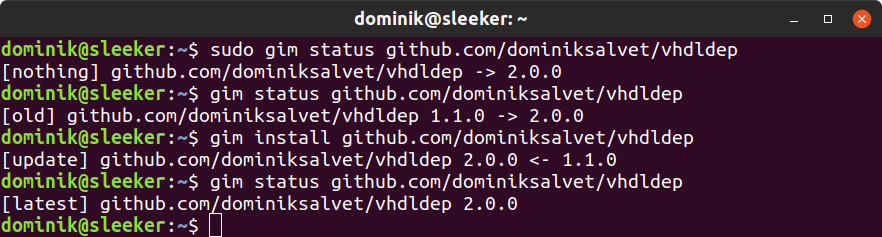

# gim

<p align="center">
    <a href="https://github.com/dominiksalvet/gim">
        </a>
</p>

<p align="center">
    <a href="https://github.com/dominiksalvet/gim">
        </a>
    <a href="https://reuse.software/">
        </a>
    <a href="https://github.com/RichardLitt/standard-readme">
        </a>
    <a href="https://travis-ci.com/dominiksalvet/gim">
        </a>
    <a href="https://discord.gg/GcpGetN">
        </a>
</p>

> SIMPLE Git-based installation manager. Cross-platform. Delta updates. Just Shell, nothing more.

Wouldn't it be great to **install and update** your favorite Git projects like this?

```
gim install <url>
```

And when they are no longer needed, **uninstall** them that way?

```
gim uninstall <url>
```

If you are in, then gim comes in pretty handy. All you need is a URL of a Git project and gim will do the rest. With respect to gim's flexibility, there are a lot of compatible projects around even without being adapted to gim at all.

---

**Are you a developer** of a Git project? Do you like the idea stated above? Then keep reading in the [Developer](#developer) section.

## Table of Contents

* [Install](#install)
* [Usage](#usage)
  * [Example](#example)
* [Developer](#developer)
  * [Badge](#badge)
* [Thanks](#thanks)
* [Contributing](#contributing)
* [License](#license)

## Install

**Global** (system) installation:

```sh
mkdir -p /tmp/gim/ && # create a temporary directory for gim repository
cd /tmp/gim/ && # go to the created directory
git clone https://github.com/dominiksalvet/gim.git . && # clone gim repository
git checkout "$(git describe --tags --abbrev=0)" && # use latest gim version
sudo make install && # install gim, requires root permissions
echo 'SUCCESS' # print a message when everything succeeded
```

**Local** (user) installation:

```sh
mkdir -p /tmp/gim/ && # create a temporary directory for gim repository
cd /tmp/gim/ && # go to the created directory
git clone https://github.com/dominiksalvet/gim.git . && # clone gim repository
git checkout "$(git describe --tags --abbrev=0)" && # use latest gim version
make install && # install gim, does not require root permissions
echo 'SUCCESS' # print a message when everything succeeded
```

---

From now on, you can use gim to update itself or even uninstall itself. If you decide to uninstall gim, it would not uninstall any project installed by gim. However, you would probably need to install gim back to manage those projects.

## Usage

**Install or update** a Git project:

```
gim install <url>
```

**Uninstall** a Git project:

```
gim uninstall <url>
```

Show **status** of a Git project:

```
gim status <url>
```

### Example

<p align="center">
    
</p>

As demonstrated above, gim works with either global or local installations based on whether it is run with root permissions.

## Developer

You may use gim in your Git projects. Why?

* No gim-specific files required
* Easy-to-use for developers and users
* Global and local installations
* Delta updates
* POSIX-friendly environment

How? Meet the rules stated in the [*RULES.md*](doc/RULES.md) file and your project will become gim ready. **Then users can use gim to manage it.**

Not sure? Try `gim status <url>` with the URL of your project - maybe it is already compatible.

### Badge

Gim ready projects work best with the following badge:

[](https://github.com/dominiksalvet/gim)

Markdown:

```markdown
[](https://github.com/dominiksalvet/gim)
```

## Thanks

Big thanks to [Jan Polák](https://github.com/Darkyenus) for help with macOS support.

## Contributing

Do you want to contribute? Do you have any questions? Then the [*CONTRIBUTING.md*](CONTRIBUTING.md) file is here for you.

## License

Licensing policy of gim is compliant with [REUSE Practices](https://reuse.software/practices/2.0/).

The preferred license is the **MIT License** as stated in the [*LICENSE.txt*](LICENSE.txt) file.
